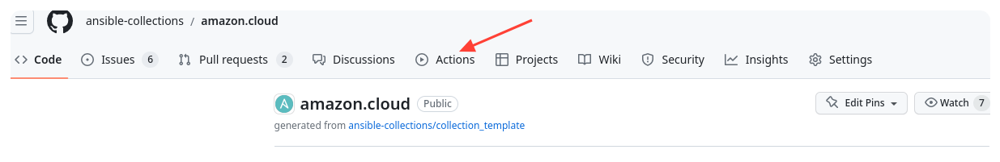
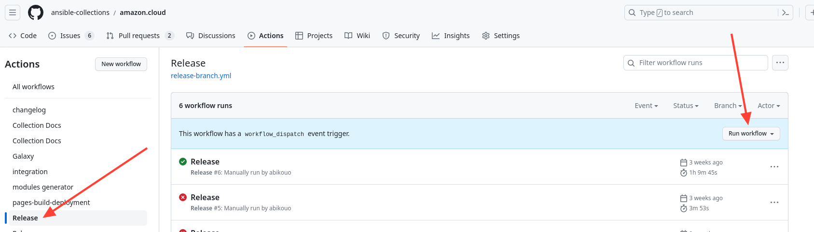
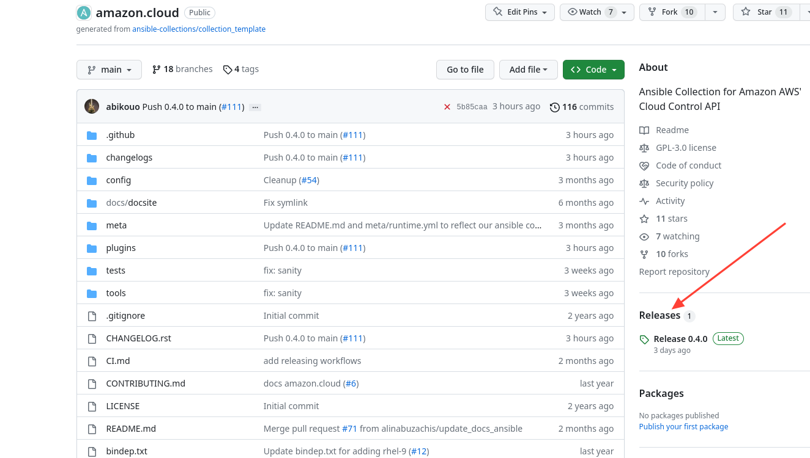

# Releasing using Github workflows

1.  [Workflow definition](#workflows)
2.  [Required Secrets](#secrets)
3.  [How to release a collection?](#howtorelease)

<div id='workflows'/>

## Workflow definition

This page describes how to release Ansible collection using Github workflows.
The following workflow need to be defined into the default branch (`main`) of the collection to release:

- **Release branch**: This workflow is triggered `manually` to create release branch or push default branch changes into an existing release branch. The `**GH_TOKEN**` secrets is required for workflow to trigger another workflow, for more information see [Github](https://github.com/ad-m/github-push-action/issues/32).

```yaml
---
name: Release
on:
  workflow_dispatch:
    inputs:
      version:
        description: "The version to release. e.g: '5.0.1'"
        required: true
jobs:
  create:
    uses: ansible-network/github_actions/.github/workflows/release-branch.yml@main
    with:
      version: ${{ github.event.inputs.version }}
    secrets:
      GH_TOKEN: ${{ secrets.GH_TOKEN }}
```

- **Release Tag**: This workflow is triggered `automatically` when a pull request on a release branch is merged with the label `ok-to-tag`. This workflow will create a Github tag on the release branch with the associated Github release. The `**GH_TOKEN**` secrets is required for workflow to trigger another workflow.

```yaml
---
name: Release
on:
  pull_request_target:
    types:
      - closed
    branches:
      - stable-*
jobs:
  tag:
    uses: ansible-network/github_actions/.github/workflows/release-tag.yml@main
    secrets:
      gh_token: ${{ secrets.GH_TOKEN }}
```

- **Release publish**: This workflow is triggered `automatically` when a new Github release is published

```yaml
---
name: Release
on:
  release:
    types:
      - published
jobs:
  publish:
    uses: ansible/devtools/.github/workflows/release_collection.yml@main
    with:
      environment: release
      ah_publish: false
    secrets:
      ansible_galaxy_api_key: ${{ secrets.ANSIBLE_GALAXY_API_KEY }}
```

This can also be triggered when a new tag is pushed using:

```yaml
on:
  push:
    tags:
      - "**"
```

<div id='secrets'/>

## Required Secrets

These workflows include jobs to validate galaxy importer, manually create release, push release tag and publish collection to ansible galaxy. The following table lists the workflows and how they are triggered.

| Name                         | Description                                                                                                                                                                                                   |
| ---------------------------- | ------------------------------------------------------------------------------------------------------------------------------------------------------------------------------------------------------------- |
| GH_TOKEN                     | Github token different from the one generated by Github for each workflow run. Must have the following permissions on the collection repository: create branch, create pull request, push tag, create release |
| ANSIBLE_GALAXY_API_KEY       | Ansible galaxy token Required. if the collection has to be published on galaxy hub.                                                                                                                           |
| ANSIBLE_AUTOMATION_HUB_TOKEN | Ansible automation hub token. Required if the collection has to be published on automation hub.                                                                                                               |

<div id='howtorelease'/>

## How to release a collection?

- **Step1**: Create/Update release branch - You need to provide the release tag
<p align="center">
  
</p>

Trigger manually the workflow to create the `stable-*` branch (if it does not exist) and create the pull request to prepare the release

<p align="center">
  
</p>

- **Step2**: Merge the pull request to the release branch

Merge the pull request with the label `ok-to-tag`, this will trigger the workflow to push tag and create Github release.

- **Step3**: Validate a new Github release and tag was created

<p align="center">
  
</p>

You can also validate that the collection has been published to ansible galaxy and/or automation hub.
